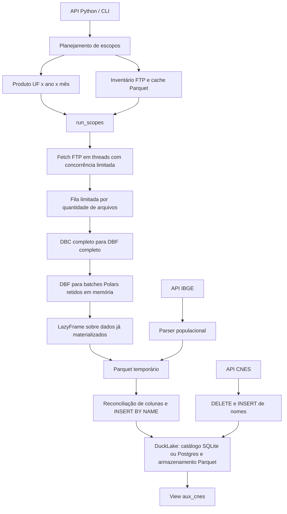

# Avaliação técnica de engenharia de dados — omnisus-db

**Data:** 09/09/2026  
**Referência:** commit `e681aceb869004dc192c4aaa588a51adc6d54ac7`  
**Escopo:** arquitetura, ingestão, consistência, qualidade dos dados, operação, testes e distribuição.  
**Natureza:** revisão do estado atual do repositório, com inspeção de código, execução da suíte existente, experimentos isolados e consulta a fontes oficiais.

## 1. Parecer executivo

O projeto apresenta uma base de código pequena e organizada, adequada para evoluir como biblioteca especializada de ingestão. O catálogo central de datasets, a separação entre descoberta e importação, os testes com fixtures DBC e as verificações de integridade DBF são escolhas positivas. Não identifiquei justificativa para uma reescrita integral ou adoção imediata de infraestrutura distribuída.

**No estado avaliado, não recomendo a operação recorrente sem supervisão nem o uso dos resultados como camada analítica confiável sem reconciliação adicional.** Há defeitos reproduzidos que permitem anunciar sucesso após falha, duplicar dados em reprocessamento, perder registros em atualização e alterar valores ao conciliar schemas. A integração populacional consulta a tabela errada do IBGE. O fluxo de publicação também diverge da versão de Python exigida pelo próprio pacote.

A suíte existente passou: **386 testes, 91,28% de cobertura de linhas**. Esse resultado demonstra boa disciplina de desenvolvimento, mas não cobre os principais modos de falha identificados. A prioridade deve ser completar as garantias de correção e recuperação antes de ampliar o volume de dados ou otimizar o parser em Rust.

Foram registrados **12 achados prioritários: 7 P1 e 5 P2**. A duplicação por reprocessamento é uma lacuna de contrato operacional confirmada, não uma alegação de violação de uma promessa explícita de deduplicação da API de baixo nível. Os demais achados incluem defeitos funcionais e incompatibilidades reproduzidas ou demonstradas pelo código/configuração. Os riscos de capacidade e governança são apresentados separadamente.

## 2. Método, abrangência e limites

Foram inspecionados os 35 arquivos Python de `src`, totalizando 3.249 linhas físicas, além dos workflows, manifesto, lockfile, documentação e testes relevantes. O repositório contém 56 arquivos Python em `tests`, incluindo arquivos de inicialização. Há 11 datasets no registro FTP e importadores específicos para população IBGE e nomes de estabelecimentos CNES.

Não havia grafo Graphify preexistente. A avaliação das relações foi feita diretamente nos imports, chamadas e fluxos de execução; nenhum resultado de grafo é usado como evidência dos achados.

Os experimentos utilizaram lakes descartáveis, criados por `TemporaryDirectory`, e a fixture SIM/RR/2023 já existente. As falhas de parsing e escrita foram injetadas de forma controlada. Para o IBGE, foram consultados os endpoints públicos de metadados, períodos e a consulta de 2022 utilizada nos testes. O código da biblioteca e os testes existentes não foram modificados. O arquivo previamente não rastreado `profile-timings.txt` foi preservado.

Ambiente observado:

| Componente | Versão |
|---|---|
| Python | 3.13.12, macOS |
| omnisus-db | 0.1.0 |
| DuckDB | 1.5.2 |
| Extensão DuckLake carregada | `415a9ebd` |
| Polars / PyArrow | 1.40.1 / 24.0.0 |
| datasus-dbc / dbfread2 | 0.1.3 / 0.1.0 |
| Frictionless / Pandera | 5.19.0 / 0.31.1 |

**Limites:** não foi executada uma carga nacional, medição de pico de memória, instalação em ambiente limpo, publicação de pacote ou integração real com Postgres/object storage. Não foi baixado novo microdado do FTP DATASUS. Os resultados não equivalem a uma auditoria de um lake já em produção ou a uma certificação de segurança. Os 47 testes desmarcados pela expressão de seleção incluem E2E externos e benchmarks; não devem ser contabilizados como aprovados.

## 3. Arquitetura observada



O desenho é proporcional ao tamanho da biblioteca. Um único consumidor escreve no lake, enquanto as conexões FTP são paralelizadas. A fila e o semáforo evitam que todos os downloads concluídos se acumulem simultaneamente. A transação por lote reduz o número de commits.

Entretanto, **atomicidade de um lote não implica idempotência da carga**, e o retorno de um `LazyFrame` não demonstra processamento integral em streaming. Esses dois limites são centrais para interpretar corretamente as garantias atuais.

### Aspectos que merecem ser preservados

- Registro de datasets compartilhado entre nomes, caminhos, planejamento, CLI e documentação, com testes de consistência.
- Distinção explícita entre `ok`, `skipped` e `failed`, embora ainda incompleta nos caminhos de exceção.
- Verificação do tamanho do DBF contra o cabeçalho e da quantidade de registros, incluindo registros marcados como excluídos.
- Inserção por nome, evitando deslocamento posicional quando layouts possuem colunas diferentes.
- Particionamento efetivo e compressão zstd; testes verificam o particionamento físico.
- Fixtures locais e separação entre testes que dependem do servidor e testes de PR.
- CI declarada para três sistemas operacionais, lint, formatação, tipagem e limite mínimo de cobertura.

## 4. Achados prioritários

P1 indica correção prioritária por impacto em integridade, completude ou entrega do produto. P2 indica defeito relevante de operação, rastreabilidade ou compatibilidade. A severidade considera o uso pretendido como pipeline de dados; não representa uma classificação CVSS.

| ID | Prioridade | Achado | Evidência |
|---|---|---|---|
| A01 | P1 | Falha de ingestão desaparece do relatório e pode produzir saída CLI zero | Reprodução com DBC inválido |
| A02 | P1 | Reprocessamento duplica os registros já importados | Duas cargas da mesma fixture |
| A03 | P1 | Fonte IBGE consulta apenas 2007 e aceita vazio em anos posteriores | API oficial + parser local |
| A04 | P1 | Rollback deixa cache de colunas incompatível com o catálogo | DDL revertido e tentativa seguinte |
| A05 | P1 | Evolução de schema não concilia tipos e pode alterar valores | Inteiro seguido de valor fracionário |
| A06 | P1 | Upsert CNES pode apagar dados antes de falhar | Falha injetada após DELETE |
| A07 | P1 | Release usa Python incompatível com o pacote | Workflow 3.12 versus requisito >=3.13 |
| A08 | P2 | Snapshot informado precede o commit da carga | IDs reportados versus histórico real |
| A09 | P2 | Compactação e vacuum não funcionam no ambiente avaliado | Chamadas reais e código de saída CLI |
| A10 | P2 | Construção da URI cloud perde ou invalida opções Postgres | Parsing com parâmetros de conexão |
| A11 | P2 | View CNES combina atributos de competências diferentes | Última competência contendo NULL |
| A12 | P2 | Caminhos com apóstrofo quebram o SQL de conexão | Caminho local sintético |

### A01 — Falha de ingestão omitida do relatório

**Local:** [runner, linha 199](/Users/raphael/PycharmProjects/omnisus-db/src/omnisus_db/sources/datasus_ftp/_runner.py:199), especialmente linhas 194–214; [CLI, linha 143](/Users/raphael/PycharmProjects/omnisus-db/src/omnisus_db/cli/main.py:143).

O escopo só entra em `batch` depois de `ingest_raw` terminar. Se parsing, criação de schema ou INSERT falhar, o handler percorre apenas os resultados já adicionados ao lote. O escopo que causou a exceção fica ausente tanto dos sucessos quanto das falhas.

**Reprodução:** uma carga solicitando um único escopo com DBC inválido retornou `outcomes=0`, `failed=0`. A CLI terminou com código **0** e exibiu `imported 0 rows (0 ok, 0 skipped, 0 failed)`.

**Impacto:** uma execução pode ser marcada como bem-sucedida pelo orquestrador mesmo sem importar o arquivo. Uma retomada baseada em `report.failed` sequer selecionará esse escopo.

**Correção proposta:** registrar o escopo em processamento antes da ingestão; ao abortar o lote, contabilizar o causador da falha e os sucessos revertidos. Diferenciar também falha de ingestão de falha de COMMIT.

**Aceite:** para toda execução encerrada normalmente, cada posição de entrada possui exatamente um outcome; erro de parsing/INSERT gera `failed` e saída CLI não zero. Testar erro no primeiro, no meio e no último escopo de um lote.

### A02 — Reprocessamento acrescenta duplicatas

**Local:** [INSERT em Lake.ingest](/Users/raphael/PycharmProjects/omnisus-db/src/omnisus_db/lake/operations.py:319), [API de importação](/Users/raphael/PycharmProjects/omnisus-db/src/omnisus_db/__init__.py:113).

A escrita sempre acrescenta registros. Não existe controle persistente por dataset/escopo, fingerprint do arquivo de origem ou substituição transacional do escopo previamente carregado.

**Reprodução:** importar SIM/RR/2023 duas vezes gravou **3.311 + 3.311 = 6.622 linhas**. Ambas as chamadas reportaram sucesso.

**Impacto:** repetição de um comando, retomada após perda do relatório ou republicação de arquivo pode inflar contagens e agregações. O cache do inventário não é um registro de ingestões realizadas.

**Correção proposta:** definir o contrato da API de alto nível. Para snapshots completos publicados por escopo, considerar substituição atômica desse escopo e manifesto com versão/hash da fonte. Um modo append pode continuar existindo, desde que explícito. A política deve distinguir a identidade lógica da carga da partição física: CNES-ST não particiona por UF.

**Aceite:** repetir o mesmo escopo não altera contagem nem conteúdo; uma fonte revisada substitui a versão anterior sem duplicar; interrupção e retomada produzem o mesmo estado de uma execução completa. Não assumir que uma chave de registro é globalmente única sem validar o dataset.

### A03 — Integração IBGE aponta para a tabela incorreta

**Local:** [fetch IBGE, linha 9](/Users/raphael/PycharmProjects/omnisus-db/src/omnisus_db/sources/ibge/fetch.py:9), [parser, linha 15](/Users/raphael/PycharmProjects/omnisus-db/src/omnisus_db/sources/ibge/parse.py:15), [teste de integração](/Users/raphael/PycharmProjects/omnisus-db/tests/integration/test_ibge_pop_e2e.py:16).

O código identifica o agregado `793`, variável `93`, como população/projeções e o utiliza para importar uma série de anos recentes. Os metadados oficiais consultados identificam esse agregado como **Contagem da População**, com início e fim em **2007**. A lista de períodos contém apenas 2007. A consulta exata de 2022 usada pelo teste retornou **HTTP 200 com `[]`**. [Metadados do agregado 793](https://servicodados.ibge.gov.br/api/v3/agregados/793/metadados), [períodos publicados](https://servicodados.ibge.gov.br/api/v3/agregados/793/periodos).

O parser converte a lista vazia em DataFrame vazio; o importador segue para o lake sem classificar a indisponibilidade. O teste simula dados de 2022 em uma tabela que não publica esse período, por isso passa sem validar a fonte real.

**Correção proposta:** formalizar se a série é de estimativas, censos ou contagens e mapear a fonte por período. A tabela `6579`, variável `9324`, corresponde a estimativas, mas sua lista de períodos consultada também tem lacunas, incluindo 2010, 2022 e 2023. **Trocar somente o número da tabela não resolve todo o contrato temporal.** [Metadados 6579](https://servicodados.ibge.gov.br/api/v3/agregados/6579/metadados), [períodos 6579](https://servicodados.ibge.gov.br/api/v3/agregados/6579/periodos).

**Aceite:** conferir disponibilidade antes da carga; classificar ano indisponível; exigir dados do período solicitado; validar unicidade município/ano; adicionar probe oficial separado dos testes offline. Registrar a natureza e a versão da população para evitar combinar estimativas e censos sem identificação.

### A04 — Cache de schema sobrevive ao rollback

**Local:** [cache de colunas e ALTER TABLE](/Users/raphael/PycharmProjects/omnisus-db/src/omnisus_db/lake/operations.py:263), [transaction](/Users/raphael/PycharmProjects/omnisus-db/src/omnisus_db/lake/operations.py:107).

`_ensure_table` adiciona cada coluna a `self._columns` imediatamente após o ALTER. Se a transação posteriormente for revertida, o catálogo perde a coluna, mas o cache Python continua afirmando que ela existe.

**Reprodução:** tabela inicialmente com `a`; lote adiciona `newcol` e aborta. Após rollback, cache = `[a, newcol]`, catálogo = `[a]`. A tentativa seguinte contendo `newcol` falha com `BinderException` porque o ALTER necessário foi pulado.

**Impacto:** uma falha contamina o estado do handle e pode provocar novas falhas nos lotes posteriores, justamente durante a recuperação de uma carga multianual.

**Correção proposta:** invalidar ou restaurar caches associados à transação quando houver rollback; contemplar falhas de COMMIT e alterações de catálogo feitas pela conexão pública.

**Aceite:** após rollback com evolução de schema, repetir a ingestão no mesmo handle funciona e o schema observado coincide com o catálogo. Exercitar esse caso através de `run_scopes`, além do teste direto do lake.

### A05 — Reconciliação de colunas não assegura compatibilidade de tipos

**Local:** [reconciliação de schema](/Users/raphael/PycharmProjects/omnisus-db/src/omnisus_db/lake/operations.py:248), [inferência no parser](/Users/raphael/PycharmProjects/omnisus-db/src/omnisus_db/sources/datasus_ftp/parse.py:161).

O primeiro arquivo determina o tipo físico da tabela. A reconciliação posterior compara nomes, mas não compatibilidade de tipos das colunas existentes. Como o fetch é concorrente, o primeiro escopo a concluir também pode variar entre execuções.

**Reproduções:** uma coluna `UInt8` seguida de `UInt16` contendo 300 gerou `ConversionException`. Mais grave: uma coluna inicialmente inteira recebeu **1,75 e armazenou 2**, sem erro.

**Impacto:** evolução de layouts pode produzir falha ou perda silenciosa de precisão. A reprodução usa frames sintéticos e confirma o comportamento da API; não demonstra que um arquivo específico do DATASUS já sofreu esse arredondamento.

**Correção proposta:** estabelecer tipos canônicos por coluna/versão ou uma política explícita de promoção sem perda. Rejeitar/quarentenar conversões incompatíveis. Preservar códigos como texto quando zeros à esquerda forem significativos.

**Aceite:** importar os mesmos layouts em ordens diferentes produz schema e conteúdo equivalentes; valores fracionários e limites numéricos são preservados ou rejeitados explicitamente. Campos ausentes, nulos e inteiramente vazios também devem compor a matriz.

### A06 — Upsert CNES não é atômico

**Local:** [DELETE e INSERT de cnes_master](/Users/raphael/PycharmProjects/omnisus-db/src/omnisus_db/sources/cnes/importers/master.py:141), chamada no mesmo arquivo, linha 186.

O método executa DELETE e depois `executemany`, sem transação envolvendo ambas as operações. O chamador tampouco estabelece essa transação.

**Reprodução:** uma linha existente foi selecionada para atualização. Após o DELETE, uma falha de INSERT foi injetada. A tabela terminou com **zero linhas**, em vez de manter o registro anterior.

**Impacto:** falhas de escrita deixam nomes de estabelecimentos ausentes ou atualização parcial. O processamento registro a registro também merece avaliação de custo de commits em cargas maiores.

**Correção proposta:** carregar os registros em staging, validar/deduplicar CNES e executar substituição em uma transação, com inserção em lote. Refresh da view deve observar somente dados confirmados.

**Aceite:** erro depois do DELETE preserva integralmente o estado anterior; lote com códigos repetidos não duplica a dimensão; atualização completa permanece idempotente.

### A07 — Workflow de release contradiz o requisito de Python

**Local:** [release.yml, linha 22](/Users/raphael/PycharmProjects/omnisus-db/.github/workflows/release.yml:22), [pyproject.toml, linha 5](/Users/raphael/PycharmProjects/omnisus-db/pyproject.toml:5), [uv.lock, linha 3](/Users/raphael/PycharmProjects/omnisus-db/uv.lock:3).

O gate de release cria ambiente **Python 3.12**, mas `requires-python` do pacote é **>=3.13**. O job de publicação depende desse gate. O lockfile ainda declara `>=3.12`, e o workflow de testes usa 3.13.

**Evidência:** a comparação local de `3.12` com o requisito empacotado retorna falso. Essa incompatibilidade é suficiente para rejeitar a instalação do wheel no gate, independentemente da disponibilidade de wheels das dependências. O workflow completo não foi executado nesta avaliação.

**Correção proposta:** decidir a versão mínima suportada e alinhar manifesto, lockfile, matriz de testes, gate e documentação. Revalidar instalação somente com binários nas plataformas suportadas. Acrescentar verificação de atualidade do lockfile; usar `--frozen` isoladamente não demonstra que ele representa o manifesto atual.

**Aceite:** build e instalação limpa do artefato em cada plataforma/versão declarada, importação do pacote instalado e rejeição automática de divergências de configuração. A limitação de wheels mencionada na documentação precisa ser reavaliada na versão escolhida; não foi medida aqui.

### A08 — ImportResult informa o snapshot anterior

**Local:** [leitura de snapshot em ingest](/Users/raphael/PycharmProjects/omnisus-db/src/omnisus_db/lake/operations.py:327).

`ingest` consulta o maior snapshot antes do COMMIT da transação externa. O resultado é entregue ao runner e não é atualizado após confirmar o lote.

**Reprodução:** primeira carga reportou snapshot **0**, mas os dados foram confirmados no snapshot **1**. A segunda reportou **1**, enquanto o commit correspondente foi **2**.

**Impacto:** auditorias, consultas históricas ou comparações que usem o ID retornado apontam para um estado anterior aos dados anunciados.

**Correção proposta:** resolver o identificador da transação confirmada ao finalizar o lote e associá-lo aos outcomes. Em um futuro ambiente com múltiplos writers, não presumir que um `max(snapshot_id)` global identifica o commit desta execução.

**Aceite:** o snapshot de cada sucesso contém as linhas do lote; um lote revertido não recebe ID de sucesso; duas cargas sucessivas apontam para seus respectivos commits.

### A09 — Manutenção do lake está quebrada

**Local:** [optimize/vacuum](/Users/raphael/PycharmProjects/omnisus-db/src/omnisus_db/lake/operations.py:124), [tratamento da CLI](/Users/raphael/PycharmProjects/omnisus-db/src/omnisus_db/cli/main.py:319).

Há três problemas relacionados à capacidade de manutenção:

- `ducklake_compact_files` não existe na extensão carregada. A chamada de `optimize` gerou `CatalogException`; a função de merge observada no catálogo é `ducklake_merge_adjacent_files`.
- `vacuum` passa INTERVAL a um parâmetro que espera timestamp, gerando `InvalidInputException`.
- O método chama limpeza de arquivos, embora prometa expirar snapshots. A CLI de optimize captura qualquer erro e termina com código **0**.

**Impacto:** tarefas agendadas podem parecer concluídas sem compactar arquivos; a política de retenção não é implementada como documentada.

**Correção proposta:** testar a API de manutenção da extensão suportada e separar expiração de snapshots da limpeza física de arquivos, definindo cutoffs e retenção. A documentação oficial distingue essas operações e usa timestamp para o cutoff da limpeza. [Limpeza de arquivos](https://ducklake.select/docs/stable/duckdb/maintenance/cleanup_of_files), [expiração de snapshots](https://ducklake.select/docs/stable/duckdb/maintenance/expire_snapshots).

**Aceite:** testar manutenção real em lake descartável com arquivos suficientes, verificar efeitos e preservação das linhas, testar retenção com snapshots elegíveis e exigir saída CLI não zero para falha operacional. A documentação web é complementar; os erros acima foram reproduzidos na versão efetivamente instalada.

### A10 — Opções da URI Postgres são descartadas ou malformadas

**Local:** [parse_target, linha 39](/Users/raphael/PycharmProjects/omnisus-db/src/omnisus_db/lake/catalog.py:39), [Lake.cloud, linha 58](/Users/raphael/PycharmProjects/omnisus-db/src/omnisus_db/lake/operations.py:58).

O parser retira toda a query da URI para separar `storage`. Assim, parâmetros como `sslmode` e `connect_timeout` desaparecem. `Lake.cloud` adiciona um novo `?storage=...` mesmo quando o catálogo recebido já tem query, fazendo o parser não encontrar `storage`.

**Reprodução:** URI com `sslmode=require&connect_timeout=10&storage=...` perdeu as duas opções de conexão; `Lake.cloud(catalog='.../db?sslmode=require', ...)` lançou `ValueError` antes de conectar.

**Impacto:** conexão cloud não respeita a configuração solicitada ou sequer abre. Não foi avaliado o comportamento efetivo de TLS de um servidor real.

**Correção proposta:** manter catálogo e armazenamento como campos separados na factory; no formato textual, remover apenas o parâmetro próprio da biblioteca e preservar a query restante com encoding correto.

**Aceite:** round-trip com opções Postgres e caracteres reservados, ausência de credenciais em mensagens diagnósticas e teste real do contrato de conexão em infraestrutura de teste.

### A11 — aux_cnes pode sintetizar uma linha que nunca existiu

**Local:** [agregações ARG_MAX](/Users/raphael/PycharmProjects/omnisus-db/src/omnisus_db/lake/operations.py:197).

A view escolhe `tp_unid` e `codufmun` por agregações independentes. Na reprodução, quando a competência mais recente contém `tp_unid=NULL`, o tipo é recuperado da competência anterior, enquanto município e `yyyymm_max` vêm da nova competência.

**Evidência:** janeiro tinha tipo `05`; fevereiro tinha tipo NULL e outro município. A view retornou tipo `05`, município de fevereiro e `yyyymm_max=202402`.

**Impacto:** o resultado parece retratar o último snapshot, mas combina atributos de momentos diferentes. A semântica de último valor não nulo pode ser desejável, porém não é a descrita no contrato atual.

**Correção proposta:** selecionar uma linha completa por CNES, ordenada por competência, com desempate determinístico. Se o objetivo for preencher valores históricos, documentar esse comportamento e conservar a proveniência temporal por atributo.

**Aceite:** última linha com NULL, empate na competência e chegada fora de ordem devem produzir resultado determinado e coerente com a semântica escolhida.

### A12 — SQL interpolado quebra caminhos válidos

**Local:** [ATTACH em make_connection](/Users/raphael/PycharmProjects/omnisus-db/src/omnisus_db/lake/connection.py:38); padrão semelhante em consultas de arquivos no lake.

Caminhos, URI e identificadores são interpolados diretamente no SQL. `_IDENTIFIER` valida algumas colunas, mas não cobre todos esses pontos de entrada.

**Reprodução:** abrir um lake temporário em diretório `D'Avila` gerou `ParserException` no ATTACH.

**Impacto:** caminhos legítimos falham, e o componente fica inadequado para receber valores não confiáveis por meio de uma aplicação consumidora. Não foi demonstrado ataque remoto, e a CLI já oferece execução SQL explícita ao usuário local; este achado não deve ser apresentado como exploração remota confirmada.

**Correção proposta:** parametrizar valores quando a instrução aceitar parâmetros; usar escaping correto de literais e quoting/validação de identificadores nos demais casos, centralizando a composição SQL.

**Aceite:** caminhos com apóstrofos, espaços e caracteres Unicode funcionam; nomes de tabela/alias inválidos são rejeitados antes de operações com efeitos colaterais.

## 5. Riscos de arquitetura e qualidade além dos defeitos

### 5.1 Memória: processamento em batches ainda retém todo o arquivo

[O parser](/Users/raphael/PycharmProjects/omnisus-db/src/omnisus_db/sources/datasus_ftp/parse.py:153) mantém o DBC recebido, descomprime o DBF inteiro e acumula todos os DataFrames em `batches`. Ao final faz concatenação e só então retorna um `LazyFrame`. `BATCH_ROWS=100_000` limita o buffer de registros Python de uma etapa, mas não o tamanho total retido em memória.

O limite da fila de downloads é por quantidade de arquivos, não por bytes. Arquivos grandes podem coexistir na fila, em produtores bloqueados, na descompressão e na materialização Polars. Portanto, o projeto tem controle de concorrência, mas não orçamento de memória independente do volume de entrada.

**Ação:** medir RSS e espaço temporário com escopos representativos e definir limites operacionais. Avaliar gravação progressiva dos batches em staging, com leitura posterior por scan; avaliar separadamente a decompression API, que já materializa o DBF completo. Não é possível estimar capacidade nacional a partir das fixtures pequenas. Mudar apenas o writer para streaming não elimina a materialização anterior.

### 5.2 Dicionários são metadados, não contratos efetivamente aplicados

Os YAMLs declaram tipos, obrigatoriedade, transformações, chaves e relacionamentos. O parser usa principalmente encoding, nomes para frame vazio e inferência do DBF. Não aplica sistematicamente `arrow_schema`, `x-transform`, constraints ou chaves antes de gravar. Na fixture SIM, `dtobito` declarado como `date` permanece String, e `sexo` declarado como `integer` permanece String.

Guardar o valor bruto é uma escolha válida, mas a documentação deve deixar clara a diferença entre representação bruta e modelo analítico. O teste chamado de interoperabilidade Pandera declara expressamente que validação real está fora de escopo e não executa Pandera para validar as linhas.

**Ação:** definir representação de entrada, normalizações obrigatórias e schema de saída. Introduzir relatórios de nulos inesperados, valores rejeitados, duplicatas, domínios e completude temporal. Para dados brutos preservados, disponibilizar transformações canônicas explícitas e testadas. Evitar que usuários interpretem schema documental como garantia física já cumprida.

### 5.3 Proveniência e recuperação ainda dependem da memória do processo

`ImportReport` não é persistido. O inventário possui nome, tamanho e modificação do arquivo, mas `available()` reduz o resultado a `ScopeKey`; esses metadados não acompanham a carga até um manifesto no lake. Não foi identificado armazenamento da versão do dicionário, hash da fonte ou identificação da execução por escopo.

Além disso, `bytes_written` mede o Parquet temporário, não os bytes finais do lake. `duration_seconds` em `Lake.ingest` começa depois de fetch e parsing, portanto não é duração completa da importação. Esses campos são úteis se nomeados e documentados com sua abrangência real.

**Ação:** persistir um registro de execução com dataset, escopo, origem, versão/hash, versão do código/schema, contagens, timestamps e snapshot confirmado. Para operações de recuperação, esse registro deve concordar transacionalmente com a gravação dos dados.

### 5.4 Resiliência varia entre as fontes

FTP tem retries limitados e distinção de erro terminal. IBGE não tem retry específico. CNES transforma diferentes falhas HTTP em `None` e retorna apenas quantidade escrita; ausências, throttling e erro de transporte não ficam individualizados no resultado público. `concurrency=0` no fetch CNES também merece validação de entrada, pois o semáforo fica sem capacidade de progresso.

No parser IBGE, somente o primeiro conjunto de resultados é considerado, valores não conversíveis são descartados e o parâmetro `year` não restringe os anos lidos. O experimento controlado pediu 2022 e recebeu uma linha de 2023; outra série de resultados foi ignorada. Isso reforça a necessidade de validar o contrato da resposta ao corrigir A03.

**Ação:** alinhar o relatório de resultados entre famílias, adicionar retry apenas para erros transitórios e registrar exclusões. Validar UF, mês, ano e concorrência na fronteira pública. Testar cancelamento e falha de COMMIT; esses cenários não foram reproduzidos nesta avaliação.

### 5.5 Governança deve acompanhar o uso dos identificadores

Há funções para recuperar CNS de sua codificação reversível e utilizá-lo como chave de ligação. Isso deve ser tratado como capacidade de acesso a identificador, sem confundir codificação com anonimização.

**Ação:** documentar os campos identificadores e a responsabilidade da aplicação consumidora sobre autorização, logs, backups, exposição de arquivos e retenção. A ausência de autenticação dentro de uma biblioteca local não é, por si, um defeito; os controles precisam ser avaliados no ambiente em que ela é implantada. Não houve inspeção de credenciais nem auditoria jurídica neste trabalho.

### 5.6 Documentação e dependências precisam representar o produto entregue

O Quick Start do README e o guia Python usam `Lake.local("./omnisus.ducklake")`, mas o parser exige o prefixo `ducklake:`. Esse exemplo foi reproduzido e falha imediatamente. Além disso, o guia recomenda anos IBGE que a origem atual não fornece.

Há dependências declaradas sem uso direto observado em `src`, como Pandera, Frictionless no caminho de ingestão, obstore e ferramentas de configuração. Algumas podem existir por intenção de interoperabilidade, mas isso deve ser declarado. O carregamento público também importa componentes pesados de forma antecipada.

**Ação:** executar snippets da documentação como smoke tests e revisar o conjunto mínimo de dependências. Tratar testes da distribuição instalada e da extensão DuckLake como parte do contrato de entrega, pois o lockfile Python não fixa sozinho todo o comportamento de extensões carregadas pelo DuckDB.

## 6. Evidência de verificação

| Verificação executada | Resultado | O que demonstra |
|---|---|---|
| `pytest -m 'not e2e and not perf' --cov=omnisus_db --cov-fail-under=85` | 386 passed; 47 deselected; 37,70 s | A suíte selecionada passou no ambiente existente |
| Cobertura de linhas | 91,28%; 1.376 statements, 120 não cobertos | Abrangência de execução; não cobertura de todas as decisões ou contratos |
| `ruff check .` | Passou | Conformidade com as regras estáticas configuradas |
| `ruff format --check .` | Passou; 94 arquivos na baseline | Conformidade de formatação da baseline |
| `mypy src` | Passou; 35 arquivos | Tipagem na configuração atual, que não é strict |
| `scripts/gen_datasets_doc.py --check` | Passou | Página gerada consistente com o registro |
| `frictionless validate .../*.yaml` | 15 recursos VALID | Comando configurado passou; não valida as linhas carregadas no lake |
| Diagnóstico adicional | 10 grupos de experimentos | Evidências de falhas e lacunas fora da suíte existente |
| Consultas IBGE | 5 respostas públicas HTTP 200 registradas | Identidade das tabelas, períodos e vazio de 2022 |

O trecho de tratamento de falha de lote em `_runner.py`, linhas 201–206, aparece entre as linhas não exercitadas na cobertura da suíte original. O teste de snapshot existente verifica apenas que o ID não é nulo e é não negativo. Os testes de evolução de schema cobrem adição, ausência e ordem de colunas, mas não rollback do cache ou perda de precisão por mudança de tipo. Esses exemplos explicam como uma suíte com cobertura alta ainda admite os defeitos encontrados.

### Artefatos anexos

- [Diagnóstico reproduzível](/Users/raphael/PycharmProjects/omnisus-db/reports/evidence/2026-09-09/reproduce.py): cria somente lakes temporários; usa fixture existente e dados sintéticos; não faz consulta ao IBGE.
- [Resultados observados](/Users/raphael/PycharmProjects/omnisus-db/reports/evidence/2026-09-09/observations.json): valores, exceções e snapshots dos experimentos.
- [Respostas oficiais do IBGE](/Users/raphael/PycharmProjects/omnisus-db/reports/evidence/2026-09-09/ibge-responses.json): URL, status e payload consultados na data da revisão.
- [Cobertura por arquivo e linha](/Users/raphael/PycharmProjects/omnisus-db/reports/evidence/2026-09-09/coverage.json).
- [Metadados da verificação](/Users/raphael/PycharmProjects/omnisus-db/reports/evidence/2026-09-09/verification.json) e [saída Frictionless](/Users/raphael/PycharmProjects/omnisus-db/reports/evidence/2026-09-09/frictionless.txt).

Para repetir o diagnóstico no ambiente do projeto:

```bash
/Users/raphael/PycharmProjects/omnisus-db/.venv/bin/python \
  /Users/raphael/PycharmProjects/omnisus-db/reports/evidence/2026-09-09/reproduce.py \
  /Users/raphael/PycharmProjects/omnisus-db
```

O script registra o comportamento encontrado; **não é uma suíte em que “passar” significa que o produto está correto**. Seus resultados devem ser comparados com os critérios de aceite para implementar regressões adequadas. A abertura de lakes reutiliza o mecanismo normal de carregamento da extensão DuckLake, que pode exigir instalação da extensão em outra máquina.

## 7. Plano de correção proposto

| Etapa | Prioridade e objetivo | Entregas | Critério de saída |
|---|---|---|---|
| 1 | Restaurar confiabilidade do resultado | A01, A03, A04, A05 e A06; testes de falha, fonte real e rollback | Nenhuma falha omitida, nenhuma perda silenciosa nos cenários reproduzidos |
| 2 | Tornar reprocessamento seguro | A02 e A08; contrato por escopo, manifesto persistente, snapshot confirmado | Repetição e retomada equivalentes à carga única, com rastreabilidade |
| 3 | Destravar entrega e manutenção | A07, A09, A10 e A12; instalação limpa e operações reais de manutenção | Artefato instalável na matriz declarada; comandos observáveis e funcionais |
| 4 | Consolidar semântica analítica | A11; contrato de tipos/dicionários, completude e proveniência | Dados e views consistentes com a documentação e com as fontes |
| 5 | Dimensionar capacidade | RSS, tempo por etapa, tamanho de arquivos, batches e carga representativa | Limites de operação medidos antes de aumentar concorrência ou migrar parser |

As etapas 1 e 3 possuem correções que podem ser desenvolvidas independentemente. A política de idempotência e a escolha das séries IBGE exigem decisões de domínio, não apenas alterações mecânicas de SQL ou URL. Os responsáveis naturais são manutenção do núcleo/lake, manutenção dos importadores e manutenção de CI, mesmo que atualmente sejam a mesma pessoa.

Para considerar uma operação recorrente confiável, proponho adotar como condições mínimas: todos os escopos contabilizados; ausência de duplicação em repetição; rollback recuperável; fidelidade dos tipos; fonte/ano validados; snapshot correto; manifesto persistido; manutenção testada; instalação reproduzível. Até essas condições serem demonstradas, o uso deve permanecer supervisionado, com conferência das cargas e das contagens por escopo.
